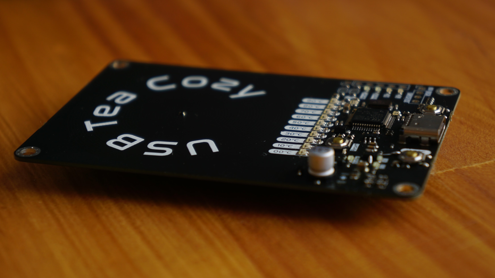
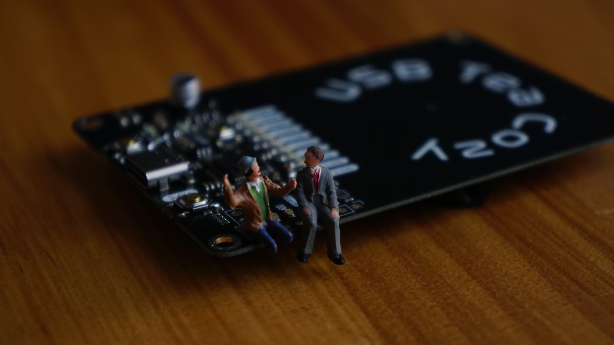
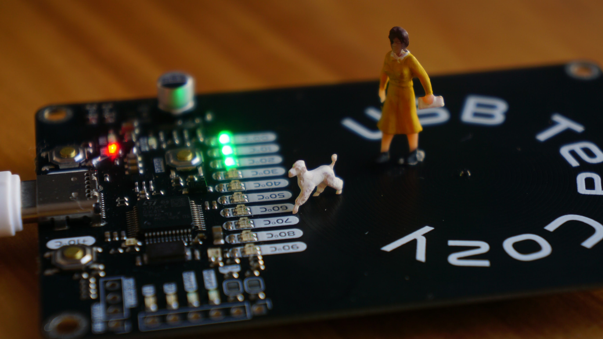

**Tea Cozy Hotplate**
=====================================

### Overview

The Tea Cozy Hotplate is a temperature-controlled hotplate designed to keep your cup of tea at the perfect temperature. It features a compact design, precise temperature control, and a user-friendly interface.

### Features

* Temperature control with ±2°C accuracy
* Compact design fits most tea cups
* User-friendly interface with addressable LED indicators
* Powered via USB-C connector (5V, 1.4A)
* STM32F103C8T6 microcontroller with 72MHz CPU

### Specifications

#### STM32 Specifications

* **CPU**: Arm Cortex-M3 @ 72MHz
* **Flash**: 64KB
* **RAM**: 20KB
* **Package**: LQFP-48

#### Components

* **Microcontroller**: STM32F103C8T6
* **LDO Regulator**: XC6206P332MR
* **ESD Protection**: SRV05
* **Fuse**: 2 x 1.5A Resettable Fuses
* **USB Connector**: USB-C Receptacle
* **Heating Element**: ~3.75Ω Spiral PCB Coil
* **Temperature Sensor**: 47kΩ NTC Thermistor

### Assembly and Programming

* Program the STM32 microcontroller using an ST-Link V2

### Issues with V1

* 3V3 LDO pinout incorrect

### Improvements for V2

* Reduce 3V3 LED brightness (half brightness)
* Use a cheaper USB-C connector
* Lower Resistance PCB Coil
* Consider Multi-Zone Heater
* Remove reset button?

## JLCPCB Heater Coil (1mm PCB with 1oz/ft^2)

* **Trace**: 2.8m length, 0.55mm width, 1oz/ft^2
* **Calculated Resistance**: 2.47Ω (assuming 0.000017Ω.mm)
* **Real-World Resistance**: 3.75Ω (calculated to be 0.0000258Ω.mm)