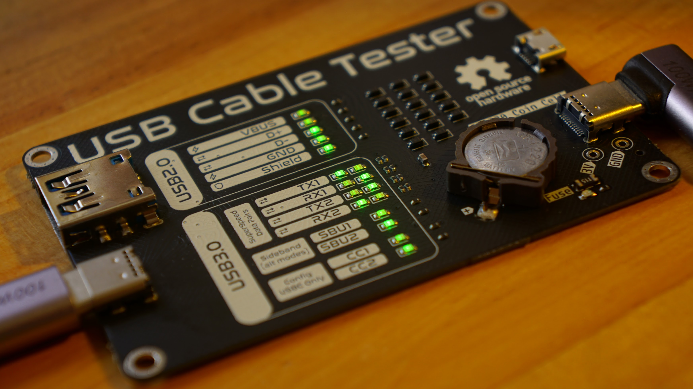

**USB Cable Tester**
=====================

### Overview

The USB Cable Tester is a simple, battery-powered device for testing USB cables. It utilizes Schottky diodes and a polyfuse for protection, and 0603 green LEDs for indicators.

### Features

* Tests USB cables for continuity and polarity
* Battery-powered (CR1220 Coincell)
* Protected by diodes and fuses
* Indicates test results with 0603 green LEDs

### Assembly

* Assemble the device according to the provided schematic and PCB layout
* Use a CR1220 Coincell battery for power

### Usage

* Plug the USB cable into the left side, then plug the other end into the right side
* The LEDs will indicate if the cable is functioning correctly

### Issues with V1

* Solder beading (causing shorts) on USB 24-pin Connector

### Improvements for V2

* Move A and B sides closer together to accommodate super short cables (10cm) for testing
* Utilize better LED binning or regulate voltage for consistent LED brightness
* Add color-coded LEDs for pin groups (power, data, config) using distinct colors
* Add Apple Lightning connector
* Verify LED brightness versus current draw to prevent excessive coin cell drain
* Add OR gate for USB-C CC pins (per specification, cables should connect only one CC pin)
* Include warning: use only with a cable; never plug directly into a USB device
* Reinforce USB-C with stitched vias and pads (similar to micro-B connector)
* Add silkscreen instructions for easy device usage
* Increase pad and trace tolerances for simplified assembly
* Consider a larger, more common CR2032 coin cell for extended battery life
* Provide a detailed explanation of each USB pin's function
