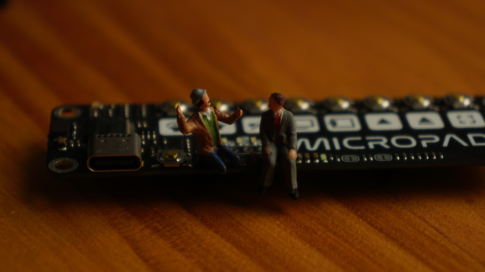

**USB MicroPad**
=====================================

### Overview

The USB MicroPad is a 8-button macro pad that can be used for a variety of applications, from productivity shortcuts to copy and paste macros. It is implemented as a USB HID keyboard and HID media consumer controller, making it compatible with all 3 major operating systems without requiring additional drivers.

### Features

* 8 programmable buttons
* USB-C connector
* 3.3V LDO regulator with low dropout voltage
* STM32F103C8T6 microcontroller with 72MHz CPU
* Compatible with most operating systems as a USB HID device

### Specifications

#### STM32 Specifications

* **CPU**: Arm Cortex-M3 @ 72Mhz
* **Flash**: 64KB
* **Ram**: 20KB
* **Package**: LQFP-48

#### Components

* **Microcontroller**: STM32F103C8T6
* **LDO Regulator**: XC6206P332MR
* **ESD Protection**: SRV05
* **Fuse**: 1.5A Resettable Fuse
* **USB Connector**: USB-C Receptacle

### Issues with V1

* 3V3 LDO pinout incorrect
* Solder beading (causing shorts) on USB 24-pin Connector

### Improvements for V2

* 3V3 LED is too bright (maybe half brightness)
* Move to cheaper USB-C connector
* Better buttons?
* Remove reset button?

### Assembly and Programming

* Program the STM32 microcontroller using an ST-Link V2