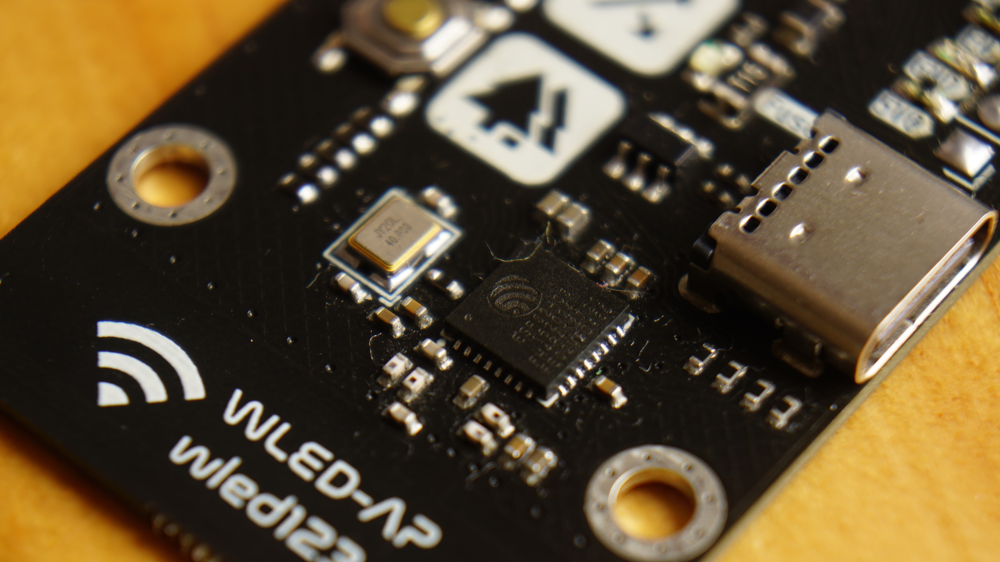
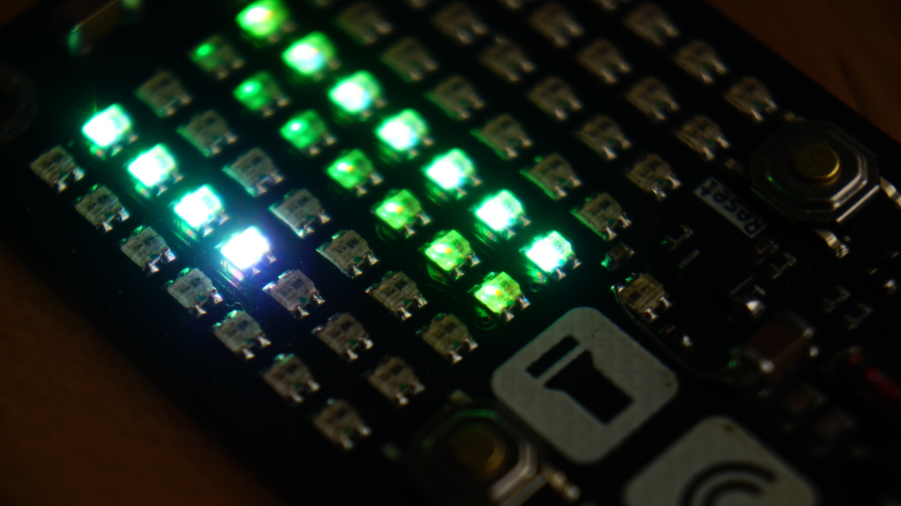

**WLED Matrix**
=====================================

## Overview

The WLED Matrix is a 7x9 RGB matrix display powered by an ESP32C3 microcontroller. It features a compact design and is capable of displaying vibrant colors and patterns.

## Specifications

* **Display**: 7x9 RGB matrix (63 LEDs + 1 level shifter LED)
* **Microcontroller**: ESP32C3 (RISC-V single-core, 160 MHz)
* **LED IC**: XL-1615RGBC-WS2812B

### ESP32C3 Specifications

* **CPU**: RISC-V single-core, 160 MHz
* **Wireless**: 2.4 GHz Wi-Fi (802.11b/g/n) and Bluetooth 5 (LE)
* **Flash**: 4 MB internal Flash
* **Package**: QFN32 (5x5 mm)

### Changes to WLED Firmware

* Recompiled to increase max buttons to 6

### Issues with V1

* Boot/IO9 pin not pulled high
* 3V3 LDO pinout incorrect
* Missing ground connection to led row 4
* Barely enough decoupling caps for the LEDs (noisy 5V supply can cause flickering LEDs)

### Improvements for V2

* Boot/IO9 led inverted (should be off most of the time)
* 3V3 led is too bright (maybe half brightness)
* Move to cheaper USB-C connector
* Potentiometer/buttons for brightness?
* Add pads for antenna matching circuit?
* Serpentine layout for data line (reduce coupling and noise)?
* Better thermal plane and vias for LEDs
* Remove reset button?
* Add inrush current limit and bulk cap for LEDs?

### Power Consumption

* 7x9 Led Matrix: ~5mA per channel per LED = ~0.95A total at full white
* ESP32C3 max power (802.11b, 1 Mbps, @21 dBm): ~0.34A
* Theoretical max current: 1.29A

### PCB Antenna

The PCB antenna design is based on the Texas Instruments CC2430DB Demo Board design (<https://www.ti.com/lit/ug/swru125/swru125.pdf>). While I don't have the equipment to perform proper testing, it seems to perform better than the Inverted F design used by default on the ESP32 and the ceramic antenna used on many ESP32C3 mini dev boards on Aliexpress.
