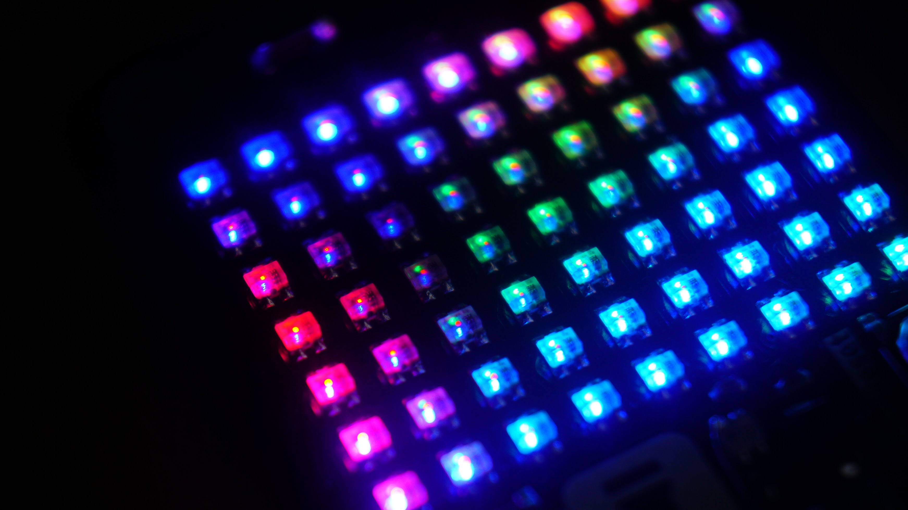

# PCB Business Cards 

Meet my PCB business cards, a collection of functional devices that showcase my passion for embedded electronics and microcontrollers. Each card is a unique project that demonstrates a specific concept or technology, from a simple USB cable tester to a complex LED matrix display. By sharing these projects, I hope to connect with like-minded individuals, inspire new ideas, and have too much fun along the way!

## USB Cable Tester

* Simple, battery-powered device for testing USB 2.0 and 3.0 cables
* Protected by Schottky diodes and polyfuse
* Indicates test results with 0603 green LEDs

[https://github.com/CDFER/Business-Cards/USB_Cable_Tester](https://github.com/CDFER/Business-Cards/tree/main/USB_Cable_Tester)

## Tea Cozy Hotplate

* Temperature-controlled hotplate for keeping tea at the perfect temperature
* Compact design, precise temperature control, and user-friendly interface

[https://github.com/CDFER/Business-Cards/Tea_Cozy_Hotplate](https://github.com/CDFER/Business-Cards/tree/main/Tea_Cozy_Hotplate)

## USB MicroPad

* 8-button macro pad for productivity shortcuts and macros
* Implemented as a USB HID keyboard and HID media consumer controller

[https://github.com/CDFER/Business-Cards/USB_Keypad](https://github.com/CDFER/Business-Cards/tree/main/USB_Keypad)

## WLED Matrix

* 7x9 RGB matrix display powered by an ESP32C3 microcontroller
* Controlled from any web browser using WLED firmware

[https://github.com/CDFER/Business-Cards/WLED_Matrix](https://github.com/CDFER/Business-Cards/tree/main/WLED_Matrix)

## Support

To support this and my future work, you can now purchase one of my custom CO2 sensors through my website or I do freelance Embedded Electronics too: [https://www.keastudios.co.nz](https://www.keastudios.co.nz/about.htm).
